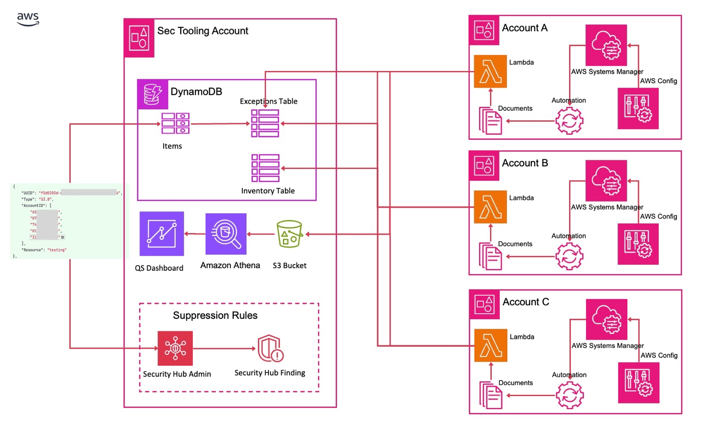
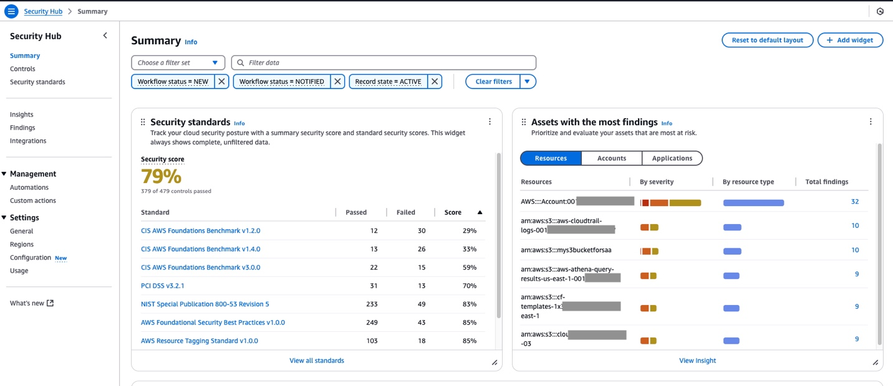
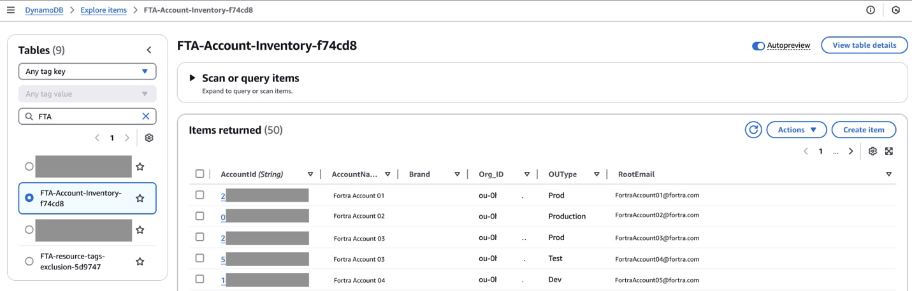
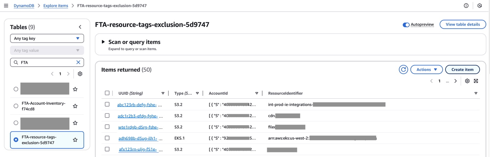
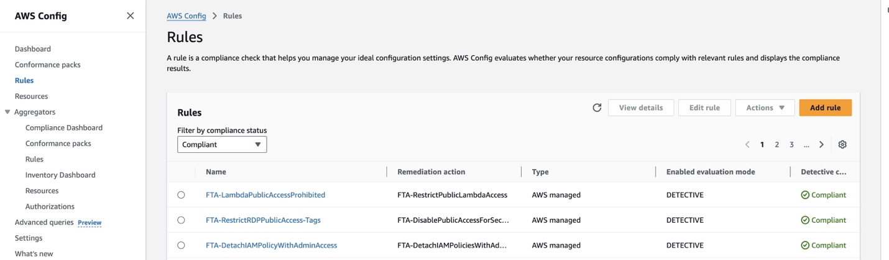
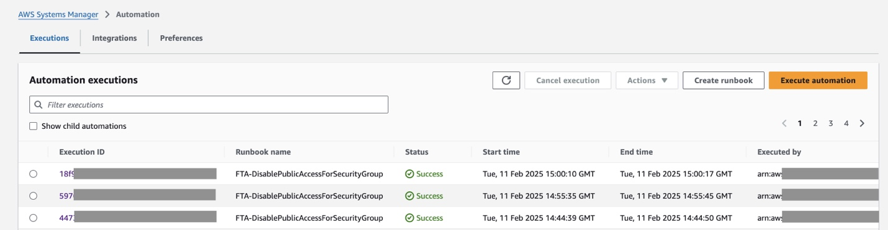
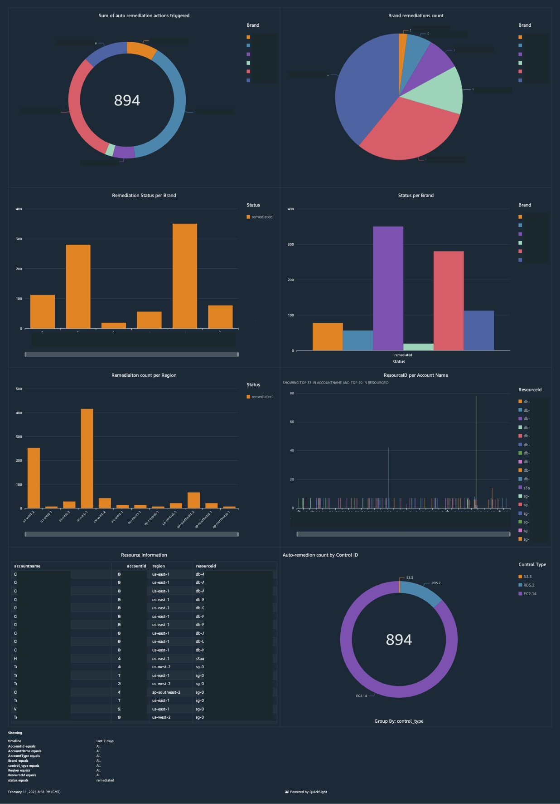

# Tự động tuân thủ bảo mật và khắc phục trên toàn tổ chức

> **📖 Bài viết gốc**: [Automate security compliance and remediation across organizations](https://aws.amazon.com/vi/blogs/infrastructure-and-automation/automate-security-compliance-and-remediation-across-organizations/) 
> **👤 Tác giả**: Pablo Santamaria Zarate, Krutarth Doshi và Pablo Santamaria Zarate
> **📅 Ngày xuất bản**: 10/04/2025  
> **🌐 Nguồn**: [Integration & Automation](https://aws.amazon.com/blogs/infrastructure-and-automation/category/infrastructure-automation/)  
> **👨‍💻 Người dịch**: Nguyễn Quốc Anh Quân - FCJ Intern  
> **📅 Ngày dịch**: 02/07/2025  
> **⏱️ Thời gian đọc**: 10 phút

## 📋 Tóm tắt
Fortra đã hợp tác với AWS để xây dựng một giải pháp tự động hóa kiểm tra và khắc phục tuân thủ bảo mật cho các tổ chức có nhiều tài khoản và vùng AWS. Giải pháp sử dụng AWS Config, Lambda, Systems Manager, CloudFormation, DynamoDB, Security Hub và Organizations để triển khai quy tắc, xử lý ngoại lệ bằng thẻ (tags), và báo cáo bằng QuickSight. Hệ thống giúp giảm thời gian xử lý từ 72 giờ xuống vài phút, duy trì kiểm soát chính xác, giảm công việc thủ công, đồng thời dễ dàng mở rộng. Fortra đang tiếp tục phát triển giải pháp này với nhiều cải tiến bổ sung.

**🎯 Đối tượng đọc**: Cloud/DevOps Engineer, Security Engineer / Architect  
**📊 Độ khó**: Intermediate.
**🏷️ Tags**: Featured, Integration & Automation, Partner solutions, Security, Identity, & Compliance.

---

## 📚 Mục lục

- [Tự động tuân thủ bảo mật và khắc phục trên toàn tổ chức](#tự-động-tuân-thủ-bảo-mật-và-khắc-phục-trên-toàn-tổ-chức)
  - [📋 Tóm tắt](#-tóm-tắt)
  - [📚 Mục lục](#-mục-lục)
- [Phần 1: Giới thiệu](#phần-1-giới-thiệu)
- [Phần 2: Phát biểu vấn đề](#phần-2-phát-biểu-vấn-đề)
- [Phần 3: Tổng quan về giải pháp](#phần-3-tổng-quan-về-giải-pháp)
- [Phần 4: Triển khai giải pháp](#phần-4-triển-khai-giải-pháp)
- [Phần 5: Bài học kinh nghiệm và thực hành tốt nhất](#phần-5-bài-học-kinh-nghiệm-và-thực-hành-tốt-nhất)
- [Phần 6: Cải tiến trong tương lai](#phần-6-cải-tiến-trong-tương-lai)
- [Kết luận](#kết-luận)
- [Về các tác giả](#về-các-tác-giả)
  - [🤝 Đóng góp và Feedback](#-đóng-góp-và-feedback)
---
# Phần 1: Giới thiệu

[Fortra](https://www.fortra.com/) , nhà cung cấp hàng đầu các giải pháp bảo mật và tuân thủ, đã hợp tác với AWS để phát triển một phương pháp tiếp cận sáng tạo nhằm tự động hóa các kiểm tra tuân thủ bảo mật và khắc phục trên các tổ chức phức tạp, nhiều tài khoản, nhiều khu vực. Bài đăng trên blog này khám phá khuôn khổ tự động hóa tuân thủ của Fortra sử dụng [AWS Config](https://aws.amazon.com/config/) , [AWS CloudFormation](https://aws.amazon.com/cloudformation/) , [Amazon DynamoDB](https://aws.amazon.com/dynamodb/) , [AWS Lambda](http://aws.amazon.com/lambda) , [AWS Organizations](https://aws.amazon.com/organizations/) , [AWS Security Hub](https://aws.amazon.com/security-hub/) và [AWS Systems Manager](https://aws.amazon.com/systems-manager/) để giảm đáng kể công sức thủ công đồng thời tăng cường thế trận bảo mật tổng thể.

Bài đăng cung cấp tổng quan chi tiết về kiến ​​trúc, các tính năng chính và quy trình triển khai của giải pháp. Bài đăng đề cập đến các chủ đề như công cụ bảo mật tập trung, triển khai quy tắc AWS Config tự động, khắc phục tùy chỉnh bằng Lambda và AWS Systems Manager, xử lý ngoại lệ dựa trên gắn thẻ và báo cáo tuân thủ toàn diện cùng khả năng hiển thị. Ngoài ra, chúng tôi chia sẻ những bài học kinh nghiệm có giá trị và các biện pháp thực hành tốt nhất thu thập được trong suốt quá trình triển khai.

---
# Phần 2: Phát biểu vấn đề
Quản lý tuân thủ bảo mật cho các tổ chức lớn với hàng nghìn tài khoản AWS có thể là một thách thức. Là một công ty bảo mật hàng đầu, Fortra sử dụng AWS Security Hub, AWS Config và Systems Manager để xác định và khắc phục rủi ro trong môi trường của họ. Tuy nhiên, việc mở rộng các quy trình tuân thủ và khắc phục này đã trở nên tốn kém về mặt tài nguyên và thời gian.

Trong khi [Security Hub có thể ngăn chặn các phát hiện bảo mật dựa trên các quy tắc ngăn chặn cụ thể](https://aws.amazon.com/blogs/security/aws-security-hub-launches-a-new-capability-for-automating-actions-to-update-findings/) , thì các biện pháp khắc phục tự động do AWS Config và Systems Manager thực hiện lại hoạt động độc lập với các quy tắc này. Điều này dẫn đến các tài nguyên được cho là miễn trừ khỏi biện pháp khắc phục tự động dựa trên các quy tắc ngăn chặn của Security Hub, vẫn bị các quy trình khắc phục nhắm mục tiêu.

Để giải quyết vấn đề này, Fortra nhận ra sự cần thiết phải có một phương pháp tiếp cận toàn diện và tập trung hơn để quản lý tuân thủ bảo mật và tự động hóa khắc phục trên cơ sở hạ tầng AWS phức tạp, nhiều tài khoản của họ. Công ty đặt mục tiêu phát triển một giải pháp sáng tạo sẽ tận dụng các dịch vụ AWS để hợp lý hóa quy trình quan trọng này đồng thời tăng cường khả năng hiển thị và kiểm soát. Bằng cách tích hợp các quy tắc ngăn chặn với thẻ tài nguyên vào quy trình khắc phục tự động của mình, Fortra tìm cách đảm bảo rằng chỉ những tài nguyên không được miễn trừ mới phải chịu các hành động khắc phục, do đó giảm thiểu sự gián đoạn không cần thiết và cải thiện hiệu quả chung.

---

# Phần 3: Tổng quan về giải pháp
Giải pháp sử dụng một số dịch vụ AWS để tạo ra một khuôn khổ tự động hóa mạnh mẽ và có khả năng mở rộng:
- [AWS Config](https://docs.aws.amazon.com/config/latest/developerguide/getting-started.html) – Để đánh giá cấu hình tài nguyên theo các quy tắc tuân thủ
- [AWS CloudFormation](https://aws.amazon.com/cloudformation/) – Dành cho việc cung cấp ngăn xếp
- [Amazon DynamoDB](https://docs.aws.amazon.com/amazondynamodb/latest/developerguide/GettingStartedDynamoDB.html) – Để lưu trữ dữ liệu tuân thủ và các quy tắc ngoại lệ
- [AWS Lambda](https://aws.amazon.com/lambda/getting-started/) – Để điều phối các kiểm tra tuân thủ và hành động khắc phục
- [AWS Organizations](https://docs.aws.amazon.com/organizations/latest/userguide/orgs_tutorials_basic.html) – Để quản lý cấu trúc và chính sách tài khoản
- [AWS Security Hub](https://aws.amazon.com/security-hub/getting-started/) – Để có khả năng hiển thị tập trung vào các phát hiện bảo mật và tạo các quy tắc ngăn chặn
- [AWS Systems Manager](https://aws.amazon.com/systems-manager/getting-started/) – Để chạy các hành động khắc phục

Kiến trúc này, như minh họa trong sơ đồ sau, bao gồm nhiều tài khoản, với một tài khoản công cụ bảo mật tập trung đóng vai trò là trung tâm quản lý tuân thủ.

Giải pháp bao gồm các tính năng chính sau:
- Tài khoản công cụ bảo mật tập trung – Một tài khoản chuyên dụng quản lý các quy tắc tuân thủ, ngoại lệ và báo cáo [trên toàn tổ chức](https://docs.aws.amazon.com/prescriptive-guidance/latest/security-reference-architecture/account-structure.html) .

- Triển khai quy tắc AWS Config tự động – Sử dụng [AWS CloudFormation StackSets](https://docs.aws.amazon.com/AWSCloudFormation/latest/UserGuide/what-is-cfnstacksets.html) , các quy tắc AWS Config được triển khai nhất quán trên tất cả các tài khoản và các Vùng AWS được chỉ định

- Khắc phục tùy chỉnh bằng Lambda và Systems Manager – Khi các quy tắc AWS Config phát hiện các tài nguyên không tuân thủ, nó sẽ thực hiện hành động khắc phục tự động sẽ chạy tài liệu tự động hóa Systems Manager tùy chỉnh để thực hiện các hành động khắc phục

- Xử lý ngoại lệ dựa trên gắn thẻ – Chiến lược [gắn thẻ](https://docs.aws.amazon.com/whitepapers/latest/tagging-best-practices/what-are-tags.html) linh hoạt cho phép các ngoại lệ đối với các quy tắc tuân thủ, cân bằng các yêu cầu bảo mật với nhu cầu kinh doanh

- Báo cáo và khả năng hiển thị tuân thủ – Bảng thông tin tùy chỉnh cung cấp thông tin chi tiết theo thời gian thực về trạng thái tuân thủ trên toàn tổ chức

Fortra đã triển khai thành công giải pháp này trong tổ chức của họ với kiến ​​trúc có khả năng mở rộng hiệu quả để hỗ trợ hàng nghìn tài khoản AWS.

---
# Phần 4: Triển khai giải pháp
Giải pháp sử dụng một số dịch vụ AWS chính để tạo ra một khuôn khổ tự động hóa tuân thủ toàn diện. [Việc kích hoạt Security Hub](https://docs.aws.amazon.com/securityhub/latest/userguide/securityhub-settingup.html) (như được hiển thị trong ảnh chụp màn hình bên dưới) và [tích hợp với các quy tắc AWS Config](https://docs.aws.amazon.com/securityhub/latest/userguide/securityhub-setup-prereqs.html) đóng vai trò là nền tảng. [Systems Manager Automation for AWS Config](https://docs.aws.amazon.com/systems-manager-automation-runbooks/latest/userguide/automation-ref-cc.html) đánh giá các tài nguyên theo các tiêu chuẩn tuân thủ được xác định trước.

[Bảng DynamoDB](https://docs.aws.amazon.com/amazondynamodb/latest/developerguide/getting-started-step-1.html) quản lý dữ liệu trong hai bảng: bảng suppression rules, quản lý các ngoại lệ tuân thủ và bảng organization inventory, duy trì cấu trúc AWS Organizations hiện tại. Thông tin bao gồm AWS account ID và Resource ID từ cả hai bảng này được sử dụng để cho phép đưa ra quyết định thông minh về khắc phục tài nguyên và xử lý ngoại lệ.

Ảnh chụp màn hình sau đây hiển thị bảng DynamoDB hiển thị danh mục tài nguyên.

Ảnh chụp màn hình sau đây hiển thị bảng DynamoDB với danh sách các tài nguyên cần đưa vào.

Các quy tắc này được [triển khai thống nhất trên tất cả các tài khoản bằng cách sử dụng CloudFormation StackSets](https://docs.aws.amazon.com/AWSCloudFormation/latest/UserGuide/what-is-cfnstacksets.html).

Các hàm Lambda điều phối quy trình làm việc tự động hóa. Khi AWS Config xác định một tài nguyên không tuân thủ, nó sẽ bắt đầu một [tài liệu Systems Manager có chứa một hàm Lambda](https://docs.aws.amazon.com/systems-manager/latest/userguide/automation-action-lamb.html) như được hiển thị trong ảnh chụp màn hình sau. Hàm này xác minh các ngoại lệ bằng cách kiểm tra các thẻ tài nguyên so với bảng quy tắc ngăn chặn. Các tài nguyên sẽ tiến hành khắc phục nếu không có ngoại lệ nào tồn tại hoặc thông tin của chúng sẽ được thu thập và gửi đến Amazon S3 để báo cáo nếu có ngoại lệ.

Dựa trên dữ liệu phát hiện được lưu trữ trong Amazon S3, bảng thông tin [Amazon QuickSight](https://aws.amazon.com/quicksight) tùy chỉnh cung cấp thông tin chi tiết về trạng thái tuân thủ. Bảng thông tin này cung cấp khả năng lọc theo đơn vị tổ chức, tài khoản, Vùng và ID kiểm soát Security Hub. Bảng thông tin theo dõi cả tài nguyên đã khắc phục và bị loại trừ đồng thời cung cấp phân tích xu hướng về các cải tiến về tuân thủ. Hình ảnh trực quan theo thời gian thực này giúp các nhóm bảo mật quản lý và ưu tiên tuân thủ ở quy mô lớn trên các tổ chức đa tài khoản lớn trong AWS Organizations.

Toàn bộ giải pháp dựa trên phương pháp gắn thẻ mạnh mẽ. Thẻ đóng nhiều vai trò quan trọng, từ việc xác định các nguồn lực miễn tuân thủ đến liên kết tài sản với các đơn vị kinh doanh và tạo điều kiện phân bổ chi phí. Để duy trì tính nhất quán, [các chính sách gắn thẻ được triển khai ở cấp độ tổ chức](https://docs.aws.amazon.com/organizations/latest/userguide/orgs_manage_policies_tag-policies-getting-started.html) , thực thi các hoạt động gắn thẻ chuẩn hóa trên tất cả các tài khoản.

# Phần 5: Bài học kinh nghiệm và thực hành tốt nhất

Giải pháp này đã hợp lý hóa việc tự động khắc phục trong khi loại bỏ nhiều giờ làm việc kỹ thuật thủ công. Trong suốt hành trình triển khai, nhóm Fortra đã thu thập được một số thông tin chi tiết có giá trị có thể mang lại lợi ích cho các tổ chức đang bắt đầu các sáng kiến ​​tự động hóa tuân thủ tương tự. Các tổ chức nên bắt đầu với một tập hợp cốt lõi các quy tắc tuân thủ quan trọng và dần dần mở rộng phạm vi, cho phép kiểm soát và xác thực tự động hóa tốt hơn. Việc hợp tác sớm với các nhóm ứng dụng đã chứng minh là rất quan trọng trong việc phát triển một chiến lược gắn thẻ hiệu quả cân bằng các yêu cầu bảo mật với các mục tiêu kinh doanh. Khi thiết kế giải pháp, các nhóm nên tập trung vào khả năng mở rộng để phù hợp với sự phát triển trong tương lai của các tài khoản AWS, Khu vực và các quy tắc tuân thủ. Mặc dù tự động hóa cải thiện hiệu quả, nhưng việc duy trì các cổng phê duyệt thủ công cho các thay đổi có rủi ro cao vẫn là điều cần thiết để kiểm soát bảo mật phù hợp.

Fortra đã tự động hóa việc quản lý các biện pháp kiểm soát bảo mật trên hơn 200 tài khoản AWS và hơn 15 Vùng, giúp giảm đáng kể công sức thủ công cần thiết. Giải pháp này cũng giảm thời gian trung bình để khắc phục các phát hiện về bảo mật từ 72 giờ xuống còn vài phút, cho phép Fortra khắc phục các phát hiện một cách nhanh chóng sau khi quy tắc Cấu hình được thực hiện mà không cần sự can thiệp bổ sung của con người. Ngoài ra, nhóm đã đạt được độ chính xác 100% khi áp dụng các biện pháp kiểm soát bảo mật trong khi vẫn tôn trọng các ngoại lệ hợp lệ thông qua việc sử dụng phương pháp xử lý ngoại lệ dựa trên gắn thẻ. Các phương pháp tiếp cận chiến lược này giúp xây dựng một khuôn khổ tự động hóa tuân thủ mạnh mẽ và bền vững, tiếp tục phát triển theo nhu cầu của tổ chức.

# Phần 6: Cải tiến trong tương lai

Nhóm Fortra tiếp tục nâng cao khả năng của giải pháp trên một số lĩnh vực chính. Fortra đang hợp tác với nhóm Tài khoản AWS để mở rộng phạm vi bao phủ của các quy tắc AWS Config, giúp khuôn khổ tự động hóa toàn diện hơn. Đồng thời, nhóm đang hợp lý hóa quy trình triển khai AWS Config trên toàn bộ tổ chức để duy trì việc áp dụng và quản lý mượt mà hơn. Để xử lý tốt hơn các quy trình tuân thủ, Fortra đang phát triển các tích hợp với các hệ thống tạo phiếu để cải thiện việc theo dõi các phê duyệt thủ công và quản lý ngoại lệ. Ngoài ra, nhóm đang tinh chỉnh các tính năng báo cáo để cung cấp phân tích xu hướng tuân thủ chi tiết, giúp các tổ chức đưa ra quyết định sáng suốt về tình hình bảo mật của họ. Những cải tiến này phản ánh cam kết của Fortra trong việc cung cấp các giải pháp tự động hóa bảo mật mạnh mẽ, cấp doanh nghiệp.

# Kết luận

Duy trì sự tuân thủ bảo mật trên một diện tích AWS lớn đòi hỏi nỗ lực đáng kể. Giải pháp này cho thấy cách các dịch vụ AWS tạo ra một khuôn khổ tự động hóa tuân thủ hiệu quả. Bằng cách kết hợp quản lý tập trung, kiểm soát dựa trên thẻ và báo cáo rõ ràng, các tổ chức có thể tăng cường bảo mật trong khi giảm công việc thủ công.

Để bắt đầu bảo vệ môi trường AWS của bạn, hãy truy cập [Bảo mật, Danh tính và Tuân thủ trên AWS](https://aws.amazon.com/products/security/).

---

# Về các tác giả

Pablo Andres Santamaria Zarate là Kiến trúc sư quản trị đám mây cao cấp tại Fortra, có hơn tám năm kinh nghiệm đa dạng trong nhiều vai trò khác nhau, bao gồm Quản trị viên hệ thống, Kỹ sư DevOps và Kỹ sư độ tin cậy của trang web (SRE). Ông chuyên thiết kế và xây dựng các giải pháp đám mây trên AWS, tận dụng nhiều dịch vụ và công nghệ. Pablo đam mê phát triển các giải pháp và tự động hóa sáng tạo để giải quyết nhiều thách thức về bảo mật, thể hiện cam kết mạnh mẽ trong việc nâng cao hiệu quả hoạt động và bảo mật trong môi trường đám mây.

Krutarth Doshi là Trưởng phòng quản lý tài khoản kỹ thuật tại AWS với hơn 10 năm kinh nghiệm trong ngành, bao gồm 3 năm hỗ trợ khách hàng Nhà cung cấp phần mềm độc lập (ISV) tại AWS. Ông chuyên phát triển và hướng dẫn khách hàng xây dựng các giải pháp tùy chỉnh để tăng cường khả năng bảo mật và phục hồi, cũng như xây dựng bảng thông tin Amazon QuickSight để cải thiện khả năng hiển thị. Krutarth đam mê giúp khách hàng giải quyết các thách thức kỹ thuật phức tạp và tận dụng các dịch vụ AWS để thúc đẩy đổi mới và đạt được mục tiêu kinh doanh của họ.

---

## 🤝 Đóng góp và Feedback

Bài dịch này được thực hiện trong khuôn khổ **FCJ Internship Program**. 

**📧 Liên hệ**: nguyenquocanhquangl@gmail.com
**💬 Feedback**: Mọi góp ý để cải thiện chất lượng dịch thuật xin gửi về email trên  
**🔄 Updates**: Bài dịch sẽ được cập nhật dựa trên feedback từ cộng đồng

---

*© 2025 - Bản dịch thuộc về Nguyen Quoc Anh Quan. Vui lòng credit khi sử dụng.*
