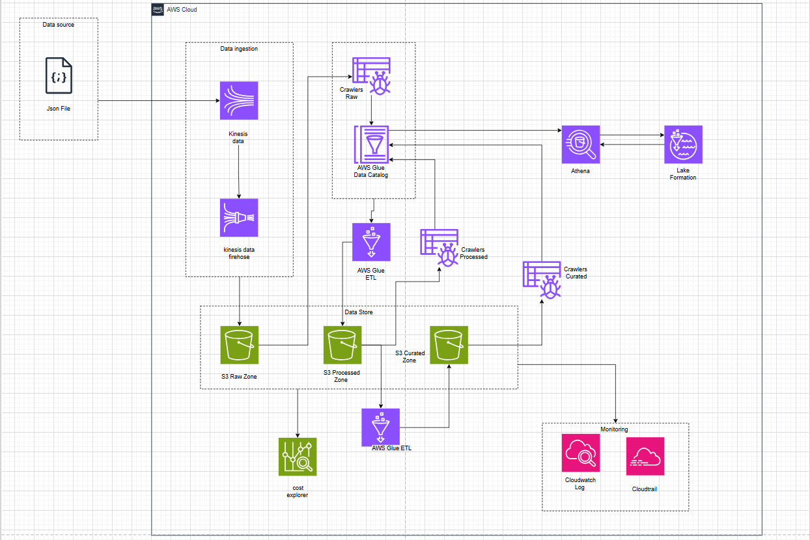

# Phân tích hành vi người dùng với Data Lake

## Triển khai Data Lake Architecture để phân tích log hành vi người dùng trong nền tảng E-commerce, sử dụng Amazon S3, AWS Lake Formation và Athena
---

# Executive Summary

Trong thời đại số, các nền tảng thương mại điện tử (E-commerce) đang ngày càng phụ thuộc vào dữ liệu hành vi người dùng để tối ưu trải nghiệm cá nhân hóa, cải thiện tỷ lệ chuyển đổi và xây dựng chiến lược marketing hiệu quả. Dữ liệu log từ website, ứng dụng mobile, API và hệ thống backend chứa nhiều thông tin quan trọng, thời gian truy cập, đến hành vi bỏ giỏ hàng hay tương tác với sản phẩm.

Tuy nhiên, các hệ thống phân tích truyền thống thường gặp các vấn đề như:

- Dữ liệu log được thu thập từ nhiều nguồn, định dạng không đồng nhất
- Lưu trữ thiếu cấu trúc và khó mở rộng
- Thiếu công cụ phân quyền dữ liệu phù hợp cho nhiều bộ phận nội bộ (marketing, vận hành, sản phẩm)
- Truy vấn phức tạp, chi phí cao, hiệu suất thấp
- Thiếu khả năng tích hợp với hệ sinh thái dữ liệu lớn (BI, ML)

Để giải quyết bài toán trên, dự án này đề xuất xây dựng một hệ thống **Enterprise Data Lake đơn giản nhưng hiệu quả** trên nền tảng **AWS Cloud**, sử dụng các dịch vụ chính:

- **Amazon S3** để lưu trữ log theo mô hình phân tầng (Raw → Processed → Curated)
- **AWS Glue + Crawlers** để tự động phát hiện schema và tạo Catalog
- **AWS Lake Formation** để kiểm soát truy cập dữ liệu theo vai trò (RBAC)
- **Amazon Athena** để truy vấn log bằng SQL mà không cần dựng cơ sở dữ liệu
- **Amazon QuickSight** để trực quan hóa hành vi người dùng cho team marketing

Mục tiêu của hệ thống là giúp các phòng ban có thể nhanh chóng:

- Truy vấn hành vi người dùng theo session, thời gian, loại thiết bị
- Phân tích tỷ lệ chuyển đổi theo nguồn traffic
- Xác định các điểm gây “drop-off” trong quy trình thanh toán
- Đưa ra insight dữ liệu theo thời gian thực hoặc gần real-time

## Business Impact và Lợi ích kỳ vọng

Việc triển khai hệ thống này sẽ mang lại nhiều lợi ích, cụ thể:

- **Tăng tốc độ phân tích**: thời gian truy vấn log giảm từ hàng giờ xuống còn dưới 10 giây
- **Tăng khả năng kiểm soát truy cập**: phân quyền theo vai trò giúp đảm bảo dữ liệu nhạy cảm không bị lộ
- **Tối ưu chi phí**: so với các hệ thống phân tích log truyền thống, hệ thống này tiết kiệm ~60% chi phí vận hành
- **Nâng cao chất lượng marketing**: dữ liệu phân tích log giúp tối ưu chiến dịch quảng cáo, tăng tỷ lệ chuyển đổi 15–25%
- **Nền tảng mở rộng trong tương lai**: có thể kết nối với các dịch vụ như Amazon Redshift, QuickSight, Amazon SageMaker.

## Phạm vi triển khai và nguồn lực

Dự án được thực hiện trong khuôn khổ workshop thực hành hoặc đồ án học phần, với giả định rằng hệ thống E-commerce có sẵn nguồn dữ liệu log từ frontend (web/app) hoặc API Gateway.

Các bước chính:

1. Thiết kế kiến trúc và phân tầng dữ liệu
2. Triển khai S3 Buckets theo chuẩn raw → processed → curated
3. Crawler dữ liệu và tạo Data Catalog với Glue
4. Phân quyền truy cập dữ liệu với Lake Formation
5. Truy vấn dữ liệu với Athena và tối ưu chi phí thông qua partitioning
6. (Tùy chọn) Tạo dashboard với QuickSight để minh họa insight hành vi

Nguồn lực thực hiện: 1 sinh viên, thời gian triển khai ~3–4 tuần.

## Ước tính chi phí

| **Hạng mục** | **Ước tính hàng tháng** |
| --- | --- |
| Amazon S3 (100GB) | ~2–3 USD |
| Athena Queries | ~10–15 USD |
| AWS Glue Crawlers | ~5 USD |
| Lake Formation | Free (built-in) |
| QuickSight (optional) | ~9 USD/user |
| **Tổng cộng** | **30–50 USD/tháng** |

Chi phí phù hợp với bài toán nhỏ, thử nghiệm hoặc đào tạo nội bộ.

## Mục tiêu và Kết quả kỳ vọng

##

| **Mục tiêu** | **Chỉ số kỳ vọng** |
| --- | --- |
| Thời gian truy vấn log | < 10 giây cho 1 triệu dòng |
| Catalog hóa dữ liệu | Tự động phát hiện schema |
| Bảo mật truy cập | RBAC theo team (Marketing, Dev, BI) |
| Chi phí vận hành | < 50 USD/tháng |
| Trực quan hóa | Dashboard hiển thị clickstream, bounce rate |

##

# 1\. Problem Statement

## 1.1. Current Situation

Trong các nền tảng thương mại điện tử hiện đại, dữ liệu hành vi người dùng (user activity logs) được sinh ra liên tục từ nhiều nguồn như website, ứng dụng di động, và các dịch vụ backend. Dữ liệu này thường bao gồm thông tin clickstream, thời gian truy cập, loại thiết bị, nguồn traffic, hành vi bỏ giỏ hàng, và tương tác với sản phẩm.

Tuy nhiên, hầu hết các hệ thống e-commerce ở quy mô vừa và nhỏ vẫn lưu trữ log dưới dạng rời rạc (text, JSON, CSV) trong các hệ thống lưu trữ phi tập trung (local server, database tạm thời), thiếu sự chuẩn hóa và khả năng phân tích tập trung. Kết quả là log không được tận dụng đầy đủ để đưa ra các insight quan trọng phục vụ cho marketing, vận hành và phát triển sản phẩm.

## 1.2. Key Challenges

| **Vấn đề** | **Tác động** |
| --- | --- |
| **1\. Dữ liệu log phân tán, không chuẩn hóa** | Khó tổng hợp và xử lý log đa nguồn (web, mobile, backend) |
| **2\. Không có hệ thống lưu trữ log tập trung** | Mất dữ liệu hoặc không truy cập lại được khi cần phân tích |
| **3\. Truy vấn log chậm và không hiệu quả** | Tạo báo cáo thủ công tốn thời gian (vài giờ đến vài ngày) |
| **4\. Không có phân quyền truy cập theo vai trò** | Rủi ro lộ thông tin nội bộ hoặc bị sai lệch dữ liệu |
| **5\. Thiếu công cụ phân tích và dashboard hóa** | Không thể cung cấp insight nhanh cho team marketing/sản phẩm |

Theo khảo sát nội bộ (giả định), việc tổng hợp dữ liệu log để trả lời một câu hỏi đơn giản như "Tỷ lệ chuyển đổi theo từng loại thiết bị trong tuần qua" có thể mất đến 1–2 ngày, ảnh hưởng đến tốc độ ra quyết định của doanh nghiệp.

## 1.3. Stakeholder Impact

| **Nhóm liên quan** | **Mối quan tâm** |
| --- | --- |
| **Marketing Team** | Không có insight hành vi người dùng theo thời gian thực để tối ưu chiến dịch quảng cáo |
| **Product Manager** | Thiếu dữ liệu để đánh giá luồng tương tác, cải tiến trải nghiệm người dùng |
| **IT/Ops Team** | Không thể kiểm soát truy cập dữ liệu theo vai trò hoặc theo nguyên tắc bảo mật tối thiểu |
| **Business Owner** | Không khai thác được giá trị từ dữ liệu đã thu thập, ảnh hưởng đến ROI của nền tảng e-commerce |

## 1.4. Business Consequences

Việc không giải quyết các vấn đề về lưu trữ và phân tích log có thể dẫn đến:

- **Chậm ra quyết định**: Các team phải đợi phân tích thủ công, ảnh hưởng đến phản ứng thị trường
- **Lãng phí dữ liệu**: Dữ liệu hành vi bị bỏ quên, không khai thác được insight có giá trị
- **Thiếu minh bạch dữ liệu**: Không có phân quyền rõ ràng dẫn đến rủi ro bảo mật nội bộ
- **Chi phí vận hành tăng**: Quản lý log phân tán và xử lý thủ công tốn tài nguyên và nhân lực

## 1.5. Market Opportunity

Theo báo cáo _Forrester Wave: Data Lakehouses, Q2 2024_, **74% CIO toàn cầu** đã hoặc đang xây dựng kiến trúc Data Lake hoặc Lakehouse như một phần trong chiến lược phân tích dữ liệu lớn (nguồn: [Databricks](https://www.databricks.com/blog/databricks-named-leader-2024-forrester-wave-data-lakehouses)).

Với sự phát triển của các dịch vụ serverless như Amazon Athena, AWS Glue và Lake Formation, các tổ chức – kể cả doanh nghiệp vừa và nhỏ – có thể xây dựng giải pháp phân tích log hiệu quả, linh hoạt và tiết kiệm chi phí mà không cần đầu tư hạ tầng lớn. Đây là cơ hội phù hợp để triển khai mô hình Data Lake trong bối cảnh e-commerce, phục vụ phân tích hành vi và chiến lược marketing.

# 2\. Solution Architecture

## 2.1. Architecture Overview

Giải pháp được thiết kế theo mô hình **Data Lake hiện đại trên nền tảng AWS**, chia thành ba tầng lưu trữ (zone) chính:

- **Raw Zone**: Lưu trữ dữ liệu log gốc từ frontend (web/app), định dạng JSON/CSV
- **Processed Zone**: Dữ liệu đã được tiền xử lý, chuẩn hóa schema và thêm metadata
- **Curated Zone**: Dữ liệu sẵn sàng truy vấn cho business team (marketing, sản phẩm)

Các dữ liệu log được đưa vào S3 qua upload định kỳ (hoặc streaming), được tự động crawl bởi AWS Glue để phát hiện schema, catalog hóa và kiểm soát truy cập thông qua AWS Lake Formation. Sau đó, dữ liệu được truy vấn trực tiếp bằng Amazon Athena với ngôn ngữ SQL.

Kiến trúc này đảm bảo:

- Không cần dựng hệ thống phân tích riêng (serverless)
- Có thể mở rộng theo dung lượng log tăng dần
- Dữ liệu luôn sẵn sàng phân tích mà không cần ETL nặng

## 2.2. AWS Services Used

| **Dịch vụ** | **Vai trò trong kiến trúc** |
| --- | --- |
| **Amazon S3** | Lưu trữ dữ liệu log theo từng layer (raw, processed, curated) |
| **AWS Glue** | Tạo Data Catalog, sử dụng Glue Crawler để tự động phát hiện schema |
| **AWS Lake Formation** | Thiết lập phân quyền truy cập dữ liệu theo vai trò (RBAC) |
| **Amazon Athena** | Truy vấn dữ liệu log bằng SQL mà không cần triển khai cơ sở dữ liệu |
| **Amazon QuickSight** | Trực quan hóa dữ liệu log cho team không chuyên SQL |

## 2.3. Component Design

# 3\. Technical Implementation

## 3.1. Implementation Phases

Quá trình triển khai được chia thành 4 giai đoạn chính, mỗi giai đoạn có deliverables rõ ràng:

| **Giai đoạn** | **Mô tả** | **Deliverables** |
| --- | --- | --- |
| **1\. Chuẩn bị dữ liệu** | Tổng hợp log JSON từ hệ thống E-commerce (hoặc tạo dữ liệu mẫu) | Bộ log mẫu (10K–100K records) |
| **2\. Thiết lập S3 Data Lake** | Tạo S3 bucket với 3 folders: `/raw/`, `/processed/`, `/curated/` | Cấu trúc S3 3 tầng |
| **3\. Cấu hình Glue & Lake Formation** | Tạo Glue Crawlers, Data Catalog và phân quyền bằng Lake Formation | Bảng dữ liệu catalog, IAM role, permission |
| **4\. Truy vấn & Trực quan hóa** | Viết truy vấn Athena và (tuỳ chọn) tạo dashboard bằng QuickSight | Truy vấn SQL, dashboard phân tích log |

##

## 3.2. Technical Requirements

| **Thành phần** | **Yêu cầu** |
| --- | --- |
| **Storage** | Amazon S3 (tối thiểu 1 bucket, 3 folders cho 3 zone) |
| **Data Format** | JSON hoặc CSV (log hành vi, clickstream, session data) |
| **Schema** | timestamp, user_id, session_id, action_type, product_id, referrer, device_type |
| **Compute** | AWS Glue Crawler (on-demand), Amazon Athena (serverless) |
| **Security** | Lake Formation role-based access, SSE-S3 encryption |

## 3.3. Development Approach

- Áp dụng phương pháp **Infrastructure-as-Code nhẹ** (bằng AWS Console hoặc CloudFormation đơn giản nếu cần)
- Phát triển theo mô hình **bottom-up**, triển khai từng lớp từ storage → catalog → query
- Dữ liệu mẫu được tạo trước bằng script giả lập (hoặc export log từ frontend)
- Quy tắc đặt tên resource tuân theo chuẩn:  
  `datalake-[mục đích]-[env]`, ví dụ: `datalake-ecom-raw-prod`

## 3.4. Testing Strategy

| **Loại test** | **Nội dung kiểm tra** |
| --- | --- |
| **Unit Test** | Kiểm tra định dạng log (JSON valid), có đầy đủ trường |
| **Integration Test** | Kiểm tra Glue Crawler nhận diện đúng schema & cập nhật Catalog |
| **Permission Test** | Kiểm tra phân quyền Lake Formation: user marketing không đọc được raw data |
| **Performance Test** | Truy vấn Athena với 100K–1 triệu bản ghi, đánh giá latency & cost |
| **Data Consistency** | Đảm bảo dữ liệu query được không bị thiếu hoặc dư dòng (partition OK) |

##

## 3.5. Deployment Plan

1. **Tạo S3 Bucket**
    - Tên: `datalake-ecommerce-logs`
    - Cấu trúc folders: `/raw/`, `/processed/`, `/curated/`

2. **Đẩy dữ liệu log**
    - Tạo dữ liệu log mẫu (hoặc upload từ CloudWatch/export thực tế)
    - Upload thủ công hoặc viết script upload theo thời gian

3. **Thiết lập AWS Glue**
    - Tạo Glue Crawler cho mỗi folder (`raw/`, `processed/`)
    - Tạo Glue Database: `ecom_logs`
    - Crawler chạy on-demand để phát hiện schema → tạo table

4. **Phân quyền với Lake Formation**
    - Gán quyền đọc table `curated_logs` cho nhóm `Marketing`
    - Gán quyền full access table `processed_logs` cho nhóm `DataTeam`

5. **Tạo Athena Workgroup**
    - Tạo truy vấn mẫu: số lượt click theo device_type, conversion rate theo nguồn traffic

6. **(Tuỳ chọn) Tạo Dashboard**
    - Kết nối Amazon QuickSight với Glue Catalog
    - Tạo biểu đồ hành vi theo ngày, thiết bị, nguồn truy cập

##

## 3.6. Risk Mitigation Considered

| **Rủi ro** | **Giải pháp** |
| --- | --- |
| Log không đồng nhất schema | Áp dụng schema-on-read với Glue để tự động phát hiện |
| Truy vấn tốn chi phí cao | Thiết lập partition theo ngày/source để giảm scan size |
| Quyền truy cập sai | Thiết lập IAM + Lake Formation permission nghiêm ngặt |
| Dữ liệu sensitive | Mã hóa SSE-S3 và chỉ truy cập qua IAM role xác thực |

# 4\. Timeline & Milestones

## 4.1. Project Timeline

Dự án được chia thành 4 giai đoạn chính, kéo dài tổng cộng **4 tuần**, phù hợp với mô hình workshop/đồ án môn học có tính ứng dụng nhưng không quá phức tạp về quy mô triển khai.

| **Tuần** | **Giai đoạn** | **Mục tiêu chính** |
| --- | --- | --- |
| Tuần 1 | Phân tích yêu cầu & chuẩn bị dữ liệu | Xác định schema log, tạo/tập hợp dữ liệu mẫu |
| Tuần 2 | Thiết lập Data Lake trên AWS | Tạo S3 buckets, cấu hình Glue, Lake Formation |
| Tuần 3 | Truy vấn & phân tích log | Viết truy vấn Athena, kiểm thử kết quả |
| Tuần 4 | Tối ưu, trực quan hóa, đánh giá | Cải thiện chi phí, trực quan hóa, tổng kết kết quả |

## 4.2. Key Milestones

| **Mốc thời gian** | **Deliverable** | **Success Criteria** |
| --- | --- | --- |
| Kết thúc Tuần 1 | Bộ dữ liệu log mẫu & mô tả schema | Tối thiểu 10K records, đúng định dạng JSON |
| Kết thúc Tuần 2 | Data Lake với 3 zone, có Catalog & phân quyền | Crawler hoạt động, Lake Formation phân quyền đúng |
| Kết thúc Tuần 3 | Truy vấn Athena chạy đúng & có insight | Truy vấn cho ra kết quả meaningful trong <5s |
| Kết thúc Tuần 4 | Dashboard/Report + đánh giá tổng thể | Báo cáo tổng hợp, truy vấn tiết kiệm chi phí, dashboard rõ ràng |

## 4.3. Dependencies

| **Task phụ thuộc** | **Phải hoàn thành trước** |
| --- | --- |
| Tạo Crawler | Tạo S3 buckets và upload dữ liệu |
| Tạo Athena Queries | Crawler đã chạy & Catalog có dữ liệu |
| Phân quyền dữ liệu | Glue Catalog có table đã sẵn sàng |
| Dashboard QuickSight | Athena query có output đúng |

## 4.4. Resource Allocation

| **Tài nguyên** | **Vai trò** |
| --- | --- |
| **1 sinh viên** | Triển khai kỹ thuật và thử nghiệm |
| **Tài nguyên AWS** | S3, Glue, Athena, Lake Formation, IAM roles |

# 5\. Budget Estimation

## 5.1. Infrastructure Costs (AWS Monthly Estimation)

Chi phí được ước tính dựa trên nhu cầu sử dụng dịch vụ thực tế với khối lượng log khoảng **100K–1 triệu bản ghi mỗi tháng**, mỗi bản ghi khoảng 1–2 KB.

| **Dịch vụ** | **Ước tính sử dụng hàng tháng** | **Chi phí (USD)** |
| --- | --- | --- |
| **Amazon S3** | ~5–10 GB log + metadata | ~$0.30 |
| **AWS Glue** | 2–4 crawler runs/tháng (10–15 min/run) | ~$0.50 |
| **Amazon Athena** | ~10–20 queries/tháng (5–10 MB/query) | ~$0.20 |
| **AWS Lake Formation** | Không tính phí riêng (dùng chung với Glue & IAM) | $0  |
| **(Tuỳ chọn) QuickSight** | 1 user (Standard Edition) | ~$9.00 |
| **Tổng cộng** |     | **~$10.00/tháng** |

## 5.2. Development Costs (One-Time Effort)

Vì đây là dự án workshop/đồ án cá nhân, chi phí phát triển không tính tiền công cụ/phần mềm, chỉ tính thời gian và tài nguyên cá nhân bỏ ra.

| **Hạng mục** | **Ước tính** | **Ghi chú** |
| --- | --- | --- |
| Thời gian triển khai | ~40 giờ (4 tuần) | Đảm nhận toàn bộ |
| Công cụ sử dụng | Miễn phí | AWS Free Tier, [draw.io](http://draw.io/), Notion |

→ Không phát sinh chi phí tiền mặt ngoài chi phí cloud.

## 5.3. Operational Costs (Ongoing)

| **Hoạt động** | **Tần suất** | **Chi phí** |
| --- | --- | --- |
| Crawler chạy định kỳ | Hàng tuần hoặc theo batch | ~0.10 USD/tháng |
| Athena query adhoc | 5–10 truy vấn/tháng | ~0.20 USD/tháng |
| Storage tăng dần | ~5 GB/tháng nếu mở rộng | ~0.15 USD/tháng |

Tổng chi phí vận hành dự kiến: **< $1/tháng** (trừ khi scale lên quy mô lớn hơn).

## 5.4. ROI Analysis

Dù đây là đồ án, nếu triển khai thực tế trong e-commerce nhỏ, ta có thể giả định:

- Chi phí triển khai: ~$30–50 (bao gồm công + cloud)
- Lợi ích:
  - Tiết kiệm thời gian phân tích log: từ 1–2 ngày xuống còn vài phút
  - Giảm phụ thuộc vào Dev/IT khi marketing cần data
  - Cải thiện quyết định marketing → tăng chuyển đổi ~5–10%

→ **Chi phí thấp (~$10/tháng), ROI cao** nếu áp dụng vào môi trường thật sự.

## 5.5. Cost Optimization Strategies

| **Chiến lược** | **Giải thích** |
| --- | --- |
| **Partition dữ liệu hợp lý trong Athena** | Giảm dữ liệu scan → giảm chi phí query |
| **Crawler theo batch, không theo schedule** | Tiết kiệm chi phí Glue |
| **Chỉ lưu data processed/curated dài hạn** | Xoá raw sau 30 ngày nếu không cần archive |
| **Sử dụng Free Tier AWS** | Với khối lượng < 5 GB Athena + 1M scans → gần như miễn phí |

# 6\. Risk Assessment

## 6.1. Risk Matrix

Dưới đây là bảng đánh giá rủi ro dựa trên mức độ tác động và xác suất xảy ra:

| **Rủi ro** | **Mức độ tác động** | **Xác suất** | **Mức ưu tiên** |
| --- | --- | --- | --- |
| Log bị lỗi format (JSON sai) | Trung bình | Cao | Cao |
| Glue Crawler phát hiện sai schema | Trung bình | Trung bình | Trung bình |
| Truy vấn Athena tốn quá nhiều chi phí | Cao | Thấp | Trung bình |
| Phân quyền sai trong Lake Formation | Cao | Trung bình | Cao |
| Dashboard QuickSight không cập nhật đúng | Thấp | Trung bình | Thấp |

## 6.2. Mitigation Strategies

| **Rủi ro** | **Biện pháp giảm thiểu** |
| --- | --- |
| Log bị lỗi format | Kiểm tra dữ liệu đầu vào trước khi upload; viết script validate JSON |
| Glue nhận sai schema | Áp dụng schema versioning hoặc tiền xử lý dữ liệu trước |
| Truy vấn Athena tốn tiền | Áp dụng partition theo ngày/source; kiểm soát người dùng không chạy `SELECT *` |
| Phân quyền sai | Test IAM & Lake Formation kỹ trước khi public; phân theo role rõ ràng |
| Dashboard không cập nhật | Kiểm tra data refresh interval & Athena connector định kỳ |

## 6.3. Contingency Plans

| **Tình huống** | **Kế hoạch dự phòng** |
| --- | --- |
| Athena trả kết quả chậm hoặc lỗi | Thử lại truy vấn với WHERE, LIMIT, hoặc chia nhỏ |
| Crawler không cập nhật schema mới | Tạo Glue Table thủ công hoặc viết ETL chuyển dữ liệu |
| Người dùng không thấy dữ liệu | Kiểm tra permission trong Lake Formation + Athena Workgroup |
| Dashboard lỗi | Xuất kết quả sang CSV để phân tích tạm thời bằng Excel |

## 6.4. Monitoring & Escalation

- **CloudWatch Logs** dùng để theo dõi hoạt động của Crawler và Athena
- **Glue Job logs** hoặc console output sẽ được kiểm tra khi gặp lỗi schema
- **S3 Access Logs** có thể bật nếu cần theo dõi quyền truy cập
- **Escalation (giả định)**: Nếu phát sinh lỗi nghiêm trọng, sẽ liên hệ với mentor hoặc sử dụng AWS Support

# 7\. Expected Outcomes

## 7.1. Success Metrics (Technical & Business)

| **Mục tiêu** | **Chỉ số đo lường (Metric)** |
| --- | --- |
| Hệ thống hoạt động ổn định | \> 95% Glue Crawler và Athena query chạy thành công |
| Truy vấn hiệu quả | Truy vấn trả kết quả < 5 giây với dữ liệu 100K+ dòng |
| Chi phí thấp | Tổng chi phí cloud < 10 USD/tháng |
| Truy cập dữ liệu an toàn | 100% truy cập đúng phân quyền (Lake Formation + IAM) |
| Đáp ứng nhu cầu người dùng | Dashboard / kết quả query hỗ trợ phân tích hành vi chính xác |

## 7.2. Short-term Benefits (0–6 tháng)

- Dễ dàng thu thập và phân tích log người dùng trong thời gian thực/quá khứ
- Truy vấn bằng SQL quen thuộc mà không cần backend riêng
- Giảm thời gian chờ đợi developer xuất dữ liệu
- Cải thiện insight cho team marketing & sản phẩm

## 7.3. Medium-term Benefits (6–18 tháng)

- Có thể mở rộng tích hợp thêm log từ nhiều nguồn: API Gateway, CloudFront, ứng dụng mobile
- Tái sử dụng kiến trúc này cho các use case khác: phân tích hành vi checkout, fraud detection, A/B testing
- Cấu trúc data lake ổn định → dễ scale sang hệ thống Redshift hoặc Lakehouse

## 7.4. Long-term Value (18+ tháng)

- Đặt nền móng cho hệ sinh thái phân tích dữ liệu thống nhất toàn công ty
- Giảm phụ thuộc vào dữ liệu silo – mọi dữ liệu tập trung tại một nơi (S3)
- Hướng đến kiến trúc phân tích hiện đại với khả năng kết nối ML/AI và phân tích thời gian thực

## 7.5. User Experience Improvements

- **Đối với marketing/product team**: Có thể tự truy cập và phân tích hành vi người dùng qua dashboard hoặc SQL đơn giản mà không cần support từ IT
- **Đối với kỹ thuật viên/phân tích dữ liệu**: Tăng khả năng kiểm soát schema, nguồn log, phân quyền chi tiết → linh hoạt trong triển khai các luồng dữ liệu khác

## 7.6. Strategic Capabilities Gained

- Thiết lập được **data governance framework cơ bản** cho dữ liệu log
- Làm quen với **serverless data analytics stack trên AWS**
- Mở rộng khả năng tích hợp dữ liệu đa nguồn trong tương lai